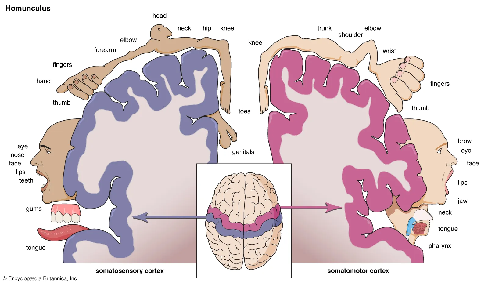

#cogsci1 #cogsci126 
## localization
Localization of function is the notion that specific areas of the brain control specific aspects of who we are, which is to some degrees the way our brain actually works. 
- *Broca's area* controls [[language]], particularly speech production
- The *fusiform face area* (FFA) controls our ability to recognize faces and people.
- The *frontal lobe* controls planning and emotion, which was discovered when **Phineas Gage** impaled this area of his brain

Each of our 5 senses has some form of **adjacency principle**, wherein the layout of the processing mechanism in the brain reflects the way that they are physically organized, or the way that we perceive them.

>[!danger] Phrenology
>Phrenology is an early localization theory, which assigned functions to areas on the *surface* of the skull, which is completely wrong.
>

Our **cerebral cortex** is divided up into 4 primary *lobes*—frontal, parietal, temporal, and occipital. This serves as a high-level division of tasks, but these regions are always communicating with one another. There are a few regions which have a highly localization-based structure, and can be mapped out:
- **Somatosensory cortex**: perception of tactile stimulus (including light, temperature, [[motion]], and pain)
- **Primary motor cortex**: controls movement
For both of these cortices, the left hemisphere corresponds to the right side of the body, and the right hemisphere controls the left side.

One major observation we can make from the above maps is that not all parts of the body are represented equally. For example, notice how the hands and mouth are dedicated very large portions of the somatosensory cortex relative to their size. This is known as **cortical magnification**. There's many examples of this:
- The **fovea** in the retina is dedicated almost the same amount of space in the [[visual cortex]] as the entire periphery. This is the **retinoptopic organization**.
#### tonotopy
Tonotopy is another adjacency organization theory dealing with *auditory signals*.

## modularity
Within the brain, modularity refers to dividing up complex processes, such as visual [[perception]], into smaller subtasks which are each processed by different areas of the brain. On a macro scale, this begins with the 
- [[visual cortex#v4 ventral stream|"What" pathway]]: after exiting the primary visual cortex, processed image data goes to the ventral stream for object identification.
- [[visual cortex#v5 dorsal stream|"Where" pathway]]: This is where processed image data goes for locating objects and detecting movement.
Within the ventral stream, further modularization occurs, with specific areas for identifying color, faces (FFA), and other features. Similarly, specific modules within the dorsal stream pinpoint the motion of the images.

---
Proposed models for how we think, particularly in terms of how we organize and process information.
### **computational representational understanding of the mind (CRUM)**
Thinking is performed when computational procedures operate on representational structures.
-   Representational structures include
    -   Concepts — _schemas_
    -   Rules — _procedural knowledge_
    -   Analogies — _reasoning & decision making_
    -   Propositions — _declarative knowledge_
    -   Imagery — _visual representations_

### marr’s tri-level hypothesis, 1998
Informational Processing Units are defined by
1.  Computational Theory - _what it wants to solve_
2.  Algorithmic Theory - _how it solves_
    1.  **Software**
3.  Implementational Theory - _the physical components it’s comprised of_
    1.  **Hardware (the brain)**

### act-r
Rule-based architecture created by John Anderson
-   Knowledge is _procedural_ or _declarative_
    -   Procedural Memory = Productions
    -   Declarative Memory = Propositions
Working memory, or perceptions, are categorized into a knowledge form.
![[actr.png|350]]

---
## prototypes & categorization
Categories exist in three levels: superordinate, basic level, and subordinate. Members of the basic level can be quickly identified by one overall shape and mental image.

### neural correlates of category specific knowledge
Research conducted by Martin Hagan et al.
-   16 healthy individuals were asked to identify objects in line drawings (animals or tools)
    -   Animals activated left occipital lobe, suggesting that participants looked more at visual attributes and features of the animal to identify it
    -   Tools activated the prefrontal area (motor cortex), suggesting that participants were considering the tool’s function
-   Concluded that there is a distinct neural activation pattern in recognizing different categories of things
    -   **Supports a distributed neural network model of semantic representations, rather than a localized (e.g. Grandmother cells) one**

### approaches to categorization
**Exemplar**
Categories are comprised of all instances of that category that you’ve encountered in the past.

**Feature**
Categories are defined by the features that are both necessary and sufficient for membership.

**Prototype**
Categories are defined by their most central member, or a representation of the average of all features.