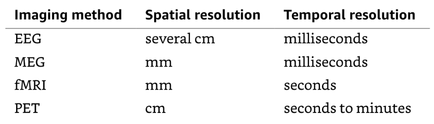

#mcb61 #cogsci1 

### static imaging techniques
**X-Rays** were invented by Wilhelm Röntgen, who won the Nobel Prize in Physics (1901) for it.
- [High energy electromagnetic radiation](https://chandra.si.edu/graphics/resources/illustrations/em_spectrum2.jpg), which allows for penetration of solid matter
- For imaging purposes, tuning the amount of radiation used can allow for visualization of different kinds of organ tissue
    - While X-rays allow for visualization of the lesion, they are limited in their ability to precisely locate the lesion

**Computed Tomography (CT)** scans were created to address the weakness of x-rays by essentially taking many x-rays from different angles to generate a 3D representation of the brain’s internal structure.
- A _computed axial tomography_, or CAT scan, takes the image slices along a central axis of symmetry across the brain

>[!danger] Invasive imaging
>Excessive exposure to the high energy of X-rays to genetic mutations and other damage at the cellular level. For this reason, X-rays and CT scans are considered invasive.

**Magnetic Resonance Imaging (MRI)** also produces 3D reconstructions of the brain that sharper and more detailed than a CT, and does so by manipulating _quantum spin,_ which is safer than CT.
- This process of introducing a magnetic field to disturb the alignment of nuclear spin gave rise to _nuclear magnetic resonance_, or NMR
    - Mapping the [[spatial frequency|spatial]] patterns of resonant energies needed to perturb the spin of atoms can be used to determine molecule structures or even image the interior of an organism
- The name was changed from NMR to MRI due to misconceptions about the technique being “nuclear”

>[!note] 
>Teslas and gauss are both units of magnetic field strength, where 1 tesla = 10,000 gauss. Earth’s magnetic field measures about 0.5 gauss, or 50 microteslas.

**Single & Multi-unit Recordings** are invasive techniques that place electrodes directly on neurons. This measures the electrophysiological response of a single cells or collection of cells.
- High temporal resolution, low spatial resolution

The above techniques are all **static, or structural imaging techniques**. However, sometimes it is necessary to measure brain activity over time, a set of techniques referred to as **dynamic, or functional imaging.**

### dynamic imaging techniques

An **Electroencephalogram (EEG)** is a graph of brain electric field changes as a function of time. These measurements are recorded by attaching electrodes to the scalp. The first EEG reading was captured by _Hans Berger_ in the 1920s.
- Gives a measure of neural activity averaged over large regions of the cerebral cortex
- EEG readings cannot give precise mappings of activity in specific locations of the brain due to the electrical conductivity of the brain and skin

The **Magnetoencephalogram (MEG)** measures another kind of brain wave involved with the magnetic fields generated by the electrical currents of the brain. MEG uses SQUIDS (supercomputing quantum interference devices) to read signals. However, the magnetic fields generated by the brain are extremely weak and susceptible to electromagnetic noise. Adjusting for these obstacles makes MEG extremely expensive and computationally difficult.

>[!tip] Wilder Penfield
>In the 1940s and 1950s, neurosurgeon _Wilder Penfield_ created the technique of **Electrocorticography (ECoG),** where he would map brain activity in patients while their brains were exposed in surgery.

**Positron Emission Tomography (PET)** scans uses the properties of radioactive chemicals to visualize cellular activity in the brain. PET may be used to generate neural activity maps based on either glucose use (energy consumption) or blood flow. This is an _invasive_ technique.

- Uses radioactive isotopes that undergo beta decay, emitting gamma rays of energy
- A PET scanner consists of an array of gamma ray detectors to create measurements
- Use of PET scans is limited due to the radioactive exposure to the patient and the complex and expensive process of administering one

**Transcranial Magnetic Simulation (TMS)** is a noninvasive method to excite neurons in the brain. Weak electric currents are induced in the brain by electromagnetic induction, producing virtual lesions to establish the importance of specific regions in the brain.

**Functional MRI (fMRI)** utilizes the same methods as a regular MRI, but takes many MRI images over time in order to gauge brain function, rather than anatomy.
- The BOLD response is based on changes in the relative concentration of oxygenated and deoxygenated hemoglobin to measure how much oxygen a particular brain region is using

_Temporal Resolution_ is the accuracy of the measure of when an event is occuring.
_Spatial Resolution_ is the accuracy of the measure of where an event is occuring.