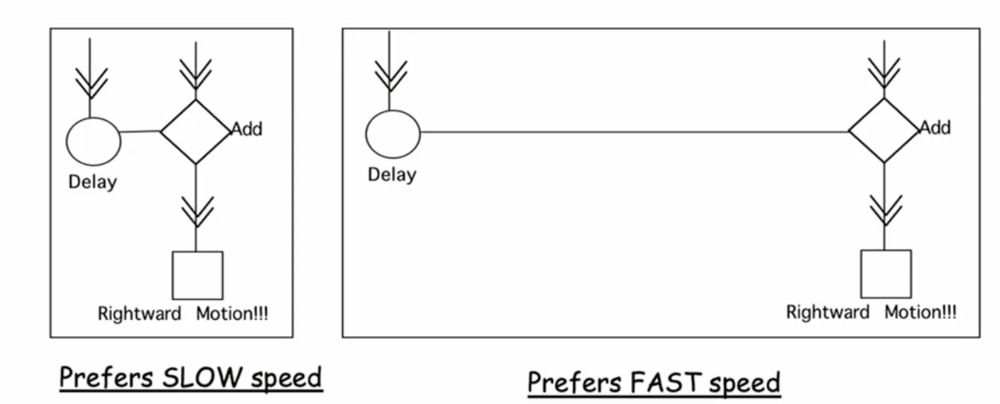

#cogsci126 

**Motion** provides valuable information within the realm of [[perception]] at all levels. Motion can help with things from simple object identification all the way to complex scenes.
 
Motion is one feature that aids our understanding of [[depth perception]]. The *motion parallax* states that objects which are closer to us appear to move faster than objects which are farther.

### optic flow
**Optic flow** is the sense of relative motion between an observer and their surroundings. This gives a sense of direction.
- **Focus of expansion**: this is the target point that you are moving towards. This point does not move as you approach it, but all its surroundings do.

>[!example] Vection
>Vection is a commonly known illusion where perceived motion in our surroundings tricks us into thinking that we're moving. This observation is supported by the fact that visual motion cues are more important to maintaining our balance and posture than mechanical cues about our own body position.

#### action
Motion allows us to estimate our time to collision $\tau$, with some object that we're approaching. We can estimate $\tau$ using 
$$\tau = r(t) / v(t)$$
where 
- $r(t)$ is the distance of the point from the center (focus of expansion) of our expanding optic flow field. This also corresponds to the retinal image size.
- $v(t)$ is the velocity of the point.

### physiology
There are two primary types of motion-sensitive neurons: inward and outward. 
- The *motion aftereffect* is an illusion where, after viewing motion in a single direction for a while, once it stops we will perceive stationary objects as moving in the opposite direction.
#### reichardt detector
Motion perception involves high level operations by our [[receptive fields]] in what's known as a **delay-and-add signal**.

Reichardt detectors work with [[receptive fields#complex cells|complex cells]] to detect motion.

>[!warning] The Aperture Problem
>Because the receptive field of a single neuron is quite small, a lot of the time the local motion information that we receive can be ambiguous with the respect to the global motion which we are trying to perceive. That is, there are many different directions of motion which could produce the same local motion.

#### pattern motion
V1 neurons detect *components* of motion, which can then be integrated to form **pattern motion**.

The medialtemporal (MT) area, or V5, of the brain contains a concentrated amount of neurons tuned to detect *patterns* of visual motion.
- MT neurons have much larger [[receptive fields]] than V1 neurons.
- These neurons integrate component motion signals from V1 neurons to detect pattern motion.
Beyond the MT area, there is also the medial superior temporal (MST) area of the V5 which goes a step further. MST neurons have even larger receptive fields than MT neurons and are selective to *optical flow* patterns of motion (i.e. expansion, contraction, rotation, and shearing).

Motion blindness occurs when there is bilateral damage to the MT/MST areas, and it causes patients to lose sensitivity to continuous motion. 

---

**Apparent motion** is a series of static images or light flashes that appear to be moving. This is different from sequential, or continuous, motion of the real world but is still widely seen in modern digital systems like TV.
