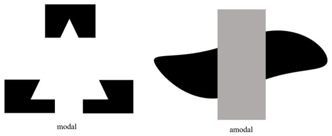
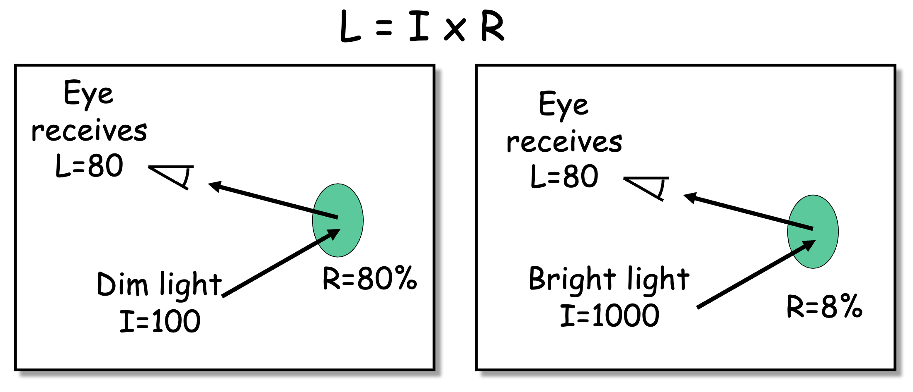

#cogsci126 

Human perception is a broad and complicated field to study. The information collected by our [[visual cortex]] is a 2-dimensional representatioin of our 3D world, but our brain is able interpret that information back into a 3-dimensional perception. 

There are many ways to study perception:
- **Psychophysics** is a field of study which relates physical stimulus with psyhological phenomena. It is an objective approach to the study of perception.

### autocalibration
Peception relies on priors and [[heuristics]] to process ambiguous information. We would choose the interpretation that is most likely. This process is known as **autocalibration**. Some examples of autocalibration include
- Adjusting to dark rooms/nighttime or, conversely, really bright environments
- We *always* perceive faces to be convex (see: [Hollow Face Illusion](https://en.wikipedia.org/wiki/Hollow-Face_illusion))

In situations of sparse information, we tend to create an interpretation that is *most likely* or familar to us.

### illusions
Illusions are the exceptions, not the rule, for the complex perceptive systems in our brain. Studying illusions provides us with the boundaries and heuristics of perception.
- **Vection**: processing motion around you makes you think you are moving when you aren't. 
- **Troxler fading**: when there's no change in stimulation, sometimes our brain stops responding (adaptation). We only process change.
- **Hermann grid**: gives the illusion of gray spots at the intersections, due to the mechanism behind [[receptive fields]], there is minimal positive net stimulus in these intersections
- **Trompe-l'œil**: this is the blanket term for the entire visual art style whch creates highly realistic 3D space and objects on a 2D surface.

---
# object identification
Hubel and Weisel's [[visual cortex|discoveries]] may have laid the foundation for the modern study of perception, but they also don't entirely hold up on their own today. Namely, they suggest that the shapes we perceive are a piecewise set of adjacent, eclosing bars—a simple and easy-to-understand model, but also not the case, because it implies that we perceive the features of an object independently from one another.

In reality, a simple shape is a *superposition* of its components. **Spatial patterns** are perceived by summing small patches of sine waves with different frequencies and amplitudes. We call these patches **wavelets**.

### surfaces
Surfaces are an intermediate level of analysis, where we are performing some basic grouping of particles. This is the first step into identifying objects. To abstract groups of particles into surfaces, they first undergo levels of abstraction:
1. Feature level encoding
2. Grouping into surfaces using [[gestalt principles]]
3. Combining surfaces into objects

>[!tip] Next: [[gestalt principles]]
##### amodal completion
The process of filling in a surface—or making the inference that a surface exists behind some occluding object or surface—is known as *amodal completion*. Occluded surfaces are more likely to be perceived as one when gestalt principles (continuity, similarity) are present.

>[!note] T-junctions
>In perception, T-junctions provide a strong clue for segregation of objects and surfaces. The intersection or overlapping between different objects forms T-junctions. By examining these junctions, we can gain valuable information regarding the border ownership, depth, and positioning of objects relative to one another.
##### modal completion
Modal completion, although less common, occurs when we construct subjective object contours in situations where they don't exist.

## faces
Perceiving faces involves special processing mechanisms. We are much more sensitive to slight differences between two people.
- Faces are always perceived to be convex.
- **Pareidolia** is the special phenomenom where people perceive some meaningful image from random stimulus.
- Facial recognition is handled by a specialized area of the [[visual cortex]] known as the **fusiform face area**
	- People with *prosopagnosia* are unable to map faces to specific peopl, and this occurs when the FFA is damaged

---
# 3-dimensional perception

Our eyes map visual information as a stream of 2-dimensional images. Our [[visual cortex]] processes these 2D representations and allows us to create our 3-dimensional interpretation of the world. The most important aspects of 3D perception are [[depth perception]] and [[motion]].

## light & shadow
The brightness that we perceive is based on two underlying factors: the **intensity** of the light source and the **surface reflectance** of the perceived object.

When we perceive images with varying light intensities (i.e. presence of shadows), our brain *discounts* for the illuminant (light source) to more accurately derive the reflectance, which is what we really want.

#### shadows
Shadows occur when light is blocked by an intervening object. How are we able to perceive them? Shadows must be
1. Darker, especially at the edge
2. Appear to lie on the surface they're on by
	1. Forming X-junctions with the surface
	2. Not appearing to have thickness or texture
However, it does not matter to humans if shadows are the wrong color, shape, or inconsistent with the lighting. We won't notice!
#### reflections
Similar to shadows, our perceptions of reflective surfaces (mirrors, water, etc.) only has a few requirements. They must be
- Lighter than the surface they're reflecting off of
- Vertically aligned with reflected objects if reflection is on a horizontal surface (water)
- Natural
Other than that, the shape, color, scene, and angle of reflection can all be different, and most people wouldn't notice.
#### concavity v. convexity
The shape and depth of a 3D object is heavily determined by the context of light, shading, and shadows. 
- Light usually comes from above, which is our implicit assumption if we don't know for sure

---
## cue integration
Thus far, we've focused on specifically on visual perception, but when we are actually perceiving the world, we integrate cues from all sensory modalities.
- Typically, the sensory modality with the highest resolution dominates our perception
- For example, temporal resolution weighs auditory information more than visual info

**Ventriloquist effect**
**McGurk effect**: when the visual and auditory cues of spoken language are misaligned, it can lead to the illusion where we perceive a third sound which combines the visual and auditory information.