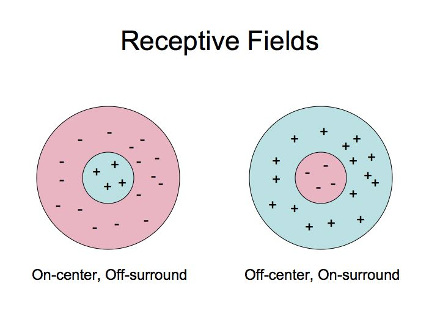
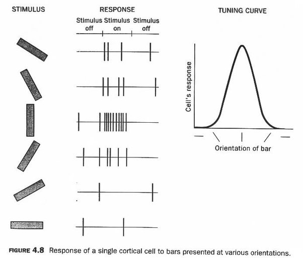

#cogsci126 

On the cell level, when a specific skin cell is *touched*, or stimulated, there is a specific corresponding neuron in the brain which is activated by that stimulation. For the neuron, that skin cell is its **receptive field**.

Similarly, for vision, a single photoreceptor in the [[visual cortex#retina|retina]] is will only perceive light stimulus in a single spot of the visual field. That spot would be considered the photoreceptor's receptive field.

This is an extremely granular way of collecting information, so there are hierarchichal structures for combining the information collected by each neuron or photorecptor.

## ganglion cells
 The [[neurons]] in the eyeball with receptive fields are **ganglion cells**, where each cell is connected to a local region of [[visual cortex|photoreceptors]]. 
- The receptive field of a ganglion cell is entirely dependent on the type of photoreceptors which it is connected to, as well as how many they're connected to

>[!tip] Contrastive Light
>In order to observe activity, there must be contrast of light in our receptive field. This is the main information gain provided by ganglion cells.

The receptive field of a ganglion cell is structured into concentric circles. Some receptive fields have ON centers, others have OFF centers.
- **ON responses**: a neuron with an ON response will fire more frequently when it is receiving light stimulus, and stops firing in the absence of light
- **OFF responses**: a neuron with an OFF response stops firing when light is shown, and starts firing in the absence of light.

The [[visual cortex#lateral geniculate nucleus|lateral geniculate nucleus]] in the brain has a similar receptive field structure.
## simple cells
Simple and complex cells were discovered by David Hubel & Torsten Wiesel, who won the Nobel Prize for Medicine in 1981 for them. These cells established a framework for studies of perception which are still relevant today. The model for simple and complex cells has been modified and built upon over time, but still resemble a lot of what they originally proposed.

>[!info] V1: Primary Visual Cortex
>The following three types of cells: simple, complex, and hypercomplex, all exist within the V1 of the brain.

What we're building up to in this hierarchical agglomeration of stimuli is [[perception]], at a high level, but also *object detection*. In order to detect objects, we must first be able to identify *edges*, which is where simple cells come in.

Simple cells receive information from multiple ganglion cells, where each ganglion cell gives us information from a "dot" or small area. Thus, their receptive field stacks the receptive fields of all of its simple cells to create an *edge*.
- Simple cells, as proposed by Hubel & Wiesel, were thought to be bar-shaped, which still contains an ON and OFF region similar to ganglion cells
- In reality, simple cells are more like *patches* of ON and OFF regions, which can be measured as simplified sine waves
- This allows them to detect orientation
	- Does not respond to dots, only oriented bars

## complex cells
Now, moving to **complex cells**, we are now looking specifically *motion* in our stimulus. 
- A complex cell stacks many simple cell receptive fields, where each simple cell is sensitive to the same orientation
- The complex cell is activated if *any one* of its simple cells is activated. Tying back to [[neurons]], it can be thought that each simple cell can only provide excitatory input when activated, but will never inhibit the complex cell.
- Each complex cell is sensitive to a specific direction of motion.
- Complex cells do not care about the type of stimulus (can be either light or dark bar) or the position

## hypercomplex cells
Hypercomplex cells, or *endstopped* cells, receive information from multiple complex cells. Hypercomplex cells not only detect orientation and motion, but now also factor in *length*.