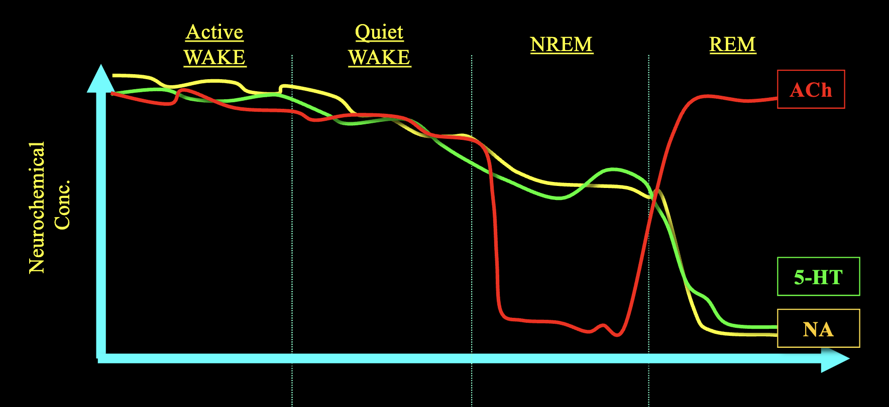

#psych133
## stages of sleep
### nrem
Non-REM sleep is comprised of 4 stages. Each stage occurs in approximately 90-minute cycles.
##### N1
NREM 1, the first stage of NREM sleep, is the lightest stage of sleep and responsible for transitioning from a wake state to a sleep state. Recent studies have shown that NREM stage 1 includes a brief period of creativity and insight called a **hypnagogic state**. This is a semi-lucid state just before we drift into sleep where one might experience vivid hallucinations or visualizations.

>[!example] Thomas Edison's "Genius Gap"
>In an 1889 interview with *Scientific American*, Thomas Edison claimed to never sleep more than 3-4 hours a night, as he believed it was a waste of time. However, Edison would nap throughout the day, while holding a steel ball in each hand. That way, when he fell asleep, he would drop the balls and wake right back up, hoping to be able to recall the thoughts and ideas dreamt up during his hypnagogic state. He called this the "Genius Gap." 
>> **"Imagination is more important than knowledge. For knowledge is limited, whereas imagination embraces the entire world, stimulating progress, giving birth to evolution."**

Stage 2 is characterized by two distinct EEG waveforms, the sleep spindle and the K-complex. **Sleep spindles** are particularly important for enabling learning in the day after and [[memory]] consolidation. They are bursts of neural activity generated by thalamus. 

##### slow-wave sleep
Stages 3 and 4 are sometimes grouped together and just known as **slow-wave sleep**. 

### rem
"Rapid eye movement", characterized by high frequency EEG. Some areas of the brain that are activated during REM sleep include:
- Cingulate cortex - emotional regulation
- Motor cortex - movement
- Hippocampus - memory
- Amygdala - emotion
- Occipital cortex - complex visual processing
Critically, the lateral prefrontal cortex is *deactivated* during REM. This area controls logical reasoning.

During REM, we can measure distinctive electrical brain bursts known as **PGO waves**. These waves are detected in sequential order in the **pons** (brainstem), followed by the lateral **geniculate** nucleus (thalamus), and finally the **occipital** lobe. PGO waves are associated with scene changes in dreams

### sleep ontogeny
*Ontogeny* is the process of an organism's development across its lifetime. Sleep habits develop and change across the span of human's lifetime. Most prominently, the sleep patterns of infants differs greatly from adulthood:
- **Monophasic**: from around 10 years old to adulthood, humans exhibit a monophasic sleep pattern. This means that there is only one sleep period in a 24-hour circadian cycle.
- **Biphasic**: toddlers (~4-8 years old) typically exhibit a biphasic sleep pattern. This means that there will be two distinct sleep periods in a day (nap + regular).
- **Polyphasic**: infants exhibit polyphasic sleep, with many sleep periods in a day. Newborns specifically exhibit *highly* polyphasic sleep, where their sleep-wake schedule is highly erratic.

>[!note] NREM:REM Ratio
>The stable NREM:REM ratio is about 4:1, which makes sense given that there are four stages of NREM, where each stage is equally around 90 minutes. Infants (0-2 years old) have high amounts of REM, where NREM slowly increases until it reaches the stable ratio.

In adulthood, even though we consistently maintain the stable 4:1 NREM:REM ratio, the total amount of sleep we get slowly decreases. Additionally, the composition of our sleep changes. By the time we reach elderly age, we exhibit little-to-no slow wave sleep (SWS), with increase awakenings and reduced REM.

### sleep-wake regulation
Sleep-wake regulation is moderated by the **two-process model**, composed of Process-S and Process-C.
- **Process S** is the *homeostatic* regulation of sleep
	- represents *sleep debt*, which monotonically increases while awake, and decreases while asleep
	- Regulated by **adenosine**, which accumulates during the day, and is cleared while we sleep (particularly during NREM)
- **Process C** is the *circadian* regulation of sleep
	- Represents the internal processes that control alertness and arousal, and is governed by our circadian clock.
	- Regulated by **melatonin**, the hormone produced in the *pineal gland* that is used to communicate "clock ticks" from the SCN to the rest of the brain
		- Melatonin secretion begins ~2-hrs before sleep time and levels remain high across the night, but are suppressed during the day.
		- Melatonin supplements can help with jet lag and circadian rhythm dysfunctions, but are no better than **placebo** in terms of aiding sleep quality
	- Unlike Process S, Process C is *not* dependent on your sleep habits, it is a constant biological rhythm
#### caffeine
Process-S is the pressure to sleep based on how long it's been since you last slept, and this is quantified physiologically by a build up of **adenosine**. 
- When we sleep, we dissipate adenosine. 
- When we're awake, adenosine builds up. 
- More adenosine buildup means more pressure to sleep.
**Caffeine** blocks the signal of adenosine, which tricks your brain into thinking you haven't been awake for as long as you have.

## sleep regulatory factors

What can actually be considered a *sleep regulatory factor*? We can rigorously define a set of criteria that must be met in order to say that a certain factor plays a role in regulating sleep.
1. If the factor is increased, sleep is increased
2. If the factor is decreased, sleep is decreased
3. The factor changes levels in the brain depending on how sleepy you are
4. It affects sleep regulatory circuits in the brain
5. The factor should be altered when in states that cause sleepiness (e.g. when you're sick)

For example, **adenosine** meets all these criteria, and thus can be considered a sleep regulatory factor.

---
# measuring sleep
There are a few different methods for measuring sleep:
1. Phenomenology: philosophical study on one's lived experience
2. Behavior-based methods: observing external behaviors in humans and other species
3. Physiology: measuring bodily functions (gold standard)
### physiology
**Polysomnography** (PSG), also known as a *sleep study*, is a set of standardized tests used to diagnose sleep disorders. It is comprised of three components:
- **EOG**: electro-oculo-gram, measures eye movements
- **EEG**: electro-encephalo-gram, measures brain waves
- **EMG**: electro-myo-gram, measures muscle activity

>[!tip] PSG of REM vs. Non-REM Sleep
>Based on the PSG of a sleeping individual, we can observe their sleep stage. 
>
>The EOG of a REM sleeper will observe regular high-amplitude bursts, whereas non-REM sleep will be spikier at lower amplitudes.
>
>The EEG of a REM sleeper will be extremely low-amplitude, whereas non-REM sleep will show slightly spikier activity.
>
>The EMG of a REM sleeper will be essentially flatlined, whereas the EMG of a non-REM sleeper will have very small waves (can be a pretty nuanced difference).

**Actigraphs** take measurements from the wrist to roughly track sleep by tracking activity, movement, and light. It is not nearly as accurate as PSG but is more accessible.
- Actigraphy is imprecise - it's good at distinguishing when you're awake versus asleep, but can't distinguish specific sleep stages
- Typically used for long-term [[circadian rhythm]] tracking

### behavior
When any organism sleeps, we can observe some set of behaviors that lets us know that they are sleeping. Commonly, this includes a horizontal position, low muscle tone, and (reversible) non-responsiveness. 
#### non-human sleep
Non-human sleep studies are a common method for researching how sleep presents itself similarly or differently phylogenically (across species from an evolutionary standpoint).
- Barrett Klein's study on honey bees found that bees also have observed sleep behavior just like humans, including reduced muscle tone and a reversible non-responsive state. They also follow a 24-hour circadian rhythm.
- Using physiological methods (EEG), studies have failed to find evidence of REM sleep in amphibians and fish. Electrical activity was indicitive of NREM sleep.
The differences in sleep between humans and other animal classes can be a clue as to which characteristics of sleep developed at which points in evolution. For example, mollusks, which came after reptiles, are believed to experience a REM-like sleep state. 

The evolution of REM in both avians and mammals is believed to have developed *independently*. NREM sleep is the original form of sleep, with REM having evolved multiple times afterwards.

Birds have physiologically confirmed cycles of REM and NREM sleep. Unlike mammals, however, their cycles are extremely short, with NREM episodes lasting around 2.5 minutes and REM episodes about 8 seconds.
- Most birds do not lose muscle tone as consistently as mammals do
- **Unihemispheric sleep**: in some avian species, we observe unihemispheric sleep, wherein half of the brain will be in NREM, but the other hemisphere will be awake.
- DARPA is studying sleep in white crowned sparrows because they can stay awake for up to two weeks at a time.

>[!fact] First Night Effect
>First night effect is a phenomenon observed in humans where sleep quality is lower when sleeping in new and unfamiliar environments. In these situations, humans may even experience unihemispheric slow-wave sleep, which allows part of the brain to remain vigilant at night.

---
# mechanisms of sleep

There are three neurotransmitters responsible for controlling sleep:
- Acetylcholine (ACh)
- Noradrenaline (NA)
- Serotonin (5-HT)
During NREM, aceytlcholine levels are lowest during NREM, and serotonin and noradrenaline both dip during REM sleep.

Certain regions of the brain play key factors in sleep regulation as well:
1. **Brainstem**: signals muscular system to relax, information from the body does not enter the cortex --> fall asleep in NREM
	- When REM begins, the brainstem is partially on, feeding *internally-generated* sensory stimuli to the cortex --> dreaming
2. **Thalamus**: sensory gate
3. **Cortex**: information processing

---
# sleep & cognition

How sleep affects critical aspects of cognition has been rigorously empirically studied.
- For non-declarative (procedural) memory, sleeping after [[learning]] helps with the consolidation of [[memory]]
	- When consolidation of procedural memory occurs during sleep depends on the type of skill (e.g. motor skills are consolidated during NREM 2, while visual discrimination skills are associated with both SWS and late REM sleep)
- Sleep within 24 hours is necessary for memories to be consolidated (for the memories to "stick")
- NREM slow wave sleep quantity and quality are both correlated with retention of declarative memories
- Sleep, particularly REM sleep, may help us abstract or generalize learned concepts better
- Transcranial direct current simulation (tDCS) is an experimental technique which places electrodes on the forehead to amplify slow waves in the prefrontal cortex. This procedure, theoretically, could help increase slow wave sleep and thus enhance the consolidation of declarative memories.
- There has not been a psychological condition which is not associated with abnormal sleep.

#### sleep deprivation 
Sleep deprivation has far-reaching negative effects on cognition and health, including your [[immune system]]. Deprivation of different stages of sleep results in varying effects:
- REM sleep deprivation caused more severe emotional responses: increased aggression, emotional instability, paranoia. This is observed due to a decrease in regulation of the **amygdala**, which is the brain area responsible for emotional processing.
	- REM rebound effect: after REM sleep deprivations, subjects tend to spend longer than usual in REM sleep

>[!danger] Is Sleep Necessary for Life? (Everson 1989)
>Rats die after 15 days of sleep deprivation, this study found. Rats die after about 20 days of just REM sleep deprivation. Finally, rats die after about 45 days of NREM sleep deprivation.
>
>As the rats stayed awake for longer, their ability to regulate body temperature failed. They also began exhibiting severe weight loss, and it was observed that the more they ate while remaining awake, the more weight they actually lost. This supports the theory that sleep is critical for metabolism and thermoregulation.
>
>The final cause of death for the rats was catastrophic free radical damage (cellular instability), which led to immune system failure and septicemia.

The **psychomotor vigilance task (PVT)** is the gold standard method for measuring sleepiness. It is a portable reaction time task which evaluates sustained attention. Some stimulus appears pseudorandomly every few seconds for about 5-10 minutes. The critical measure is the number of lapses, *not* the speed of the reaction time. 