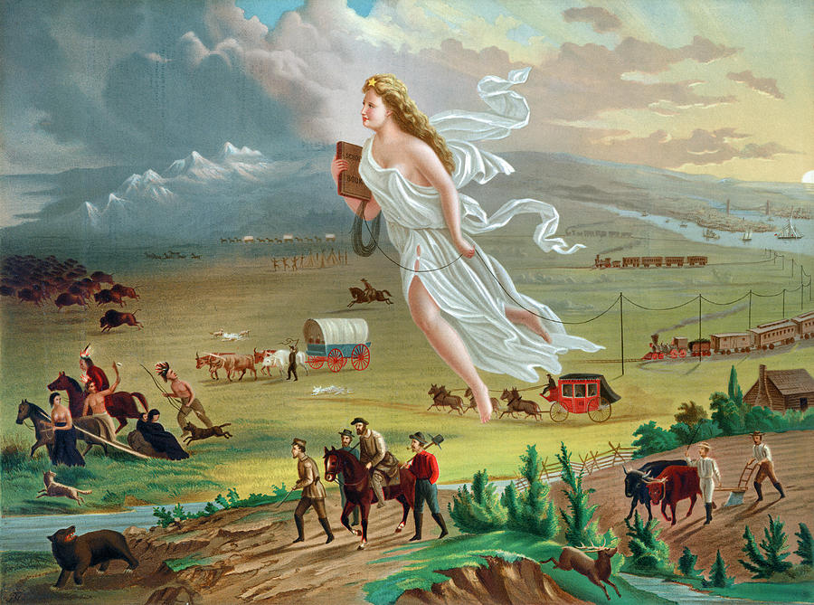

#music128 

## manifest destiny
The period of manifest destiny in the 19th century and the concept of the frontier gave way to much cultural iconography and ideas considered to be uniquely American. 
- **Spaghetti Westerns**: a sub-genre of low budget films produced in Europe (stereotypically in Italy, hence the name "spaghetti") meant to mock **Westerns**, which are films "set in the American West that embody the spirit, the struggle, and the demise of the new frontier."
- **Marlboro Man**: a rugged, cowboy-esque figure depicted in tobacco ad campaigns in the 1950s which was meant to make filtered cigarettes seem more masculine

##### *The Significance of the Frontier in American History* (1893)
by Frederick Jackson Turner

Turner's Frontier Thesis argues that the American frontier was so integral in developing American culture and identity that the two are indistinguishable from one another.
- The frontier represented freedom and ideas of American democracy and eroded any lingering European ideas of feudalism
- The frontiersman lifestyle was based on simplicity and egalitarianism, with a rejection of high culture 

---
## the great migration
**The black belt** is a region of the American South known for its fertile soil and ideal conditions for growing certain crops. At one point in the 1800s, some 90% of African Americans resided in the black belt.

Following the emancipation of slaves, Africans began leaving the black belt in droves to northern industrial cities, such as Chicago, Detroit, and New York City. This period is known as the **Great Migration** of the early 20th century.
- The period lasted roughly 50 years, from about 1915 all the way to the 1970s
- Over this time, about 6 million African Americans migrated from the South to the North
#### historical context
The Great Migration follows directly from the US Industrial Revolution, which began after the Civil War in the late 1800s. Northern industrial factories were looking to hire cheap, unskilled laborers to meet growing production demands.

>[!warning] The Red Summer
>The Red Summer of 1919 was a period of racial violence in over 25 major US cities against African Americans.

#### cultural impact
The Great Migration created Black hubs in major US cities, which led to a number of cultural shifts and movements that have shaped modern American culture.

>[!hint] Harlem Renaissance
>In New York in the 1920s and 1930s, there was a cultural revival of neo-African American culture, specifically centered around music and the arts.

