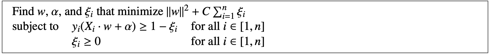

#cs189 
## hard margin svm
This is the simple case for an SVM classifier, where our data points are *linearly separable*.

## soft-margin svm
A **support vector machine** (SVM) essentially solves the following quadratic programming [[optimization]] problem:
 

Notice how, in comparison to the hard margin SVM from before, we've now added slack variables $\xi_i$. 