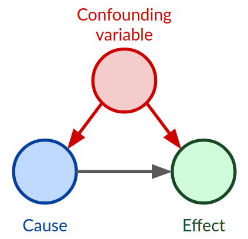

Within statistics and data science, one of the basic lessons is that within an observational study, *correlation does not mean causation*. The reason this is the case is because of the presence of confounding factors. 

**Causal inference** is a field dedicated to quantitatively determining how some specific treatment $T$ impacts some outcome $Y$. Causal questions are framed using a [[bayesian network]]: 
- 'Patient' $X$, where $X$ is some high-dimensional data that encompasses all of the non-treatement features and potential confounding factors about the patient.
- Treatment $T$, which is the factor we're specifically trying to investigate
- Outcome $Y$, the observed effect

Within causal inference, there are two primary schools of thought.
### rubin-neyman framework
For each data point (e.g. patient) $x_i$, there are two potential outcomes:

| Term            | Notation   | Definition                                                    |
| --------------- | ---------- | ------------------------------------------------------------- |
| Control Outcome | $Y_0(x_i)$ | The potential outcome $y_i$ had $x_i$ not been given treament |
| Treated Outcome | $Y_1(x_i)$ | The potential outcome $y_i$ had $x_i$ been given treatment    |
Take note of the fact that these outcomes are represented as a [[random variable]]. Because of this, there are two notable values that we can calculate: the conditional average treatment effect (CATE) and the average treatment effect (ATE).
$$CATE(x_i) = $$
$$ATE(x) := \mathbb{E}[Y_1 - Y_0] \cong \mathbb{E}_x[CATE(x)]$$
The CATE can be interpreted as the expected outcome of a patient if treated, given their underlying feature set $x_i$.

>[!danger] The fundamental problem of causal inference
>We only ever observe one of the possible outcomes. The **counterfactual** is the expected value of the outcome we *didn't* observe, making it an entirely non-empirical value.

