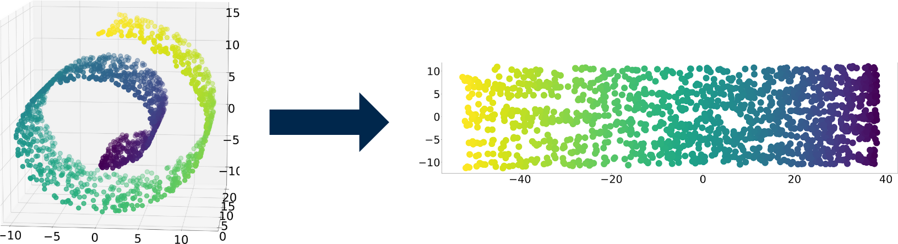

>[!example] Dimensionality Reduction Methods
>- [[principal components analysis]]
>  - [[random projection]]

The motivation for **dimensionality reduction** is to *reduce redundancy* in data. Oftentimes, raw data is a representation of many complex statistical dependencies, or redundancies. Thus, the goal of dimensionality reduction techniques is to represent that same data as the combination of some set of independent components. This allows us to
- Make computations cheaper by compressing data
- Remove irrelevant features, noise, or systematic artifacts
- Find the basis for representing complex things

> [!idea] Projection onto a subspace
> Given a subspace composed of orthonormal vectors $v_1, v_2, \dots, v_k$, the projection of vector $x$ onto the subspace is $\tilde{x} = \sum_{i=1}^k (x \cdot v_i) v_i$.

## manifold learning
The **manifold hypothesis** states that "high dimensional data tends to lie in the vicinity of a low dimensional manifold." A manifold can be thought of as a space that locally feels like a Euclidian space.

**Manifold learning**, also known as non-linear dimensionality reduction, is a class of methods aiming to project high-dimensional data, potentially existing across non-linear manifolds which cannot be adequately captured by linear decomposition methods, onto lower-dimensional latent manifolds.

#### local linear embedding
For every data point $X_i$, find the $k$-nearest neighboring data points by Euclidian distance. We want to reconstruct $X_i$ from a weighted sum of all these neighbors $N_j$, $1 \le j \le k$. 
$$\widetilde{X_i} = \sum_j \big( W_{ij}  X_j \big)$$
$$\epsilon(W) = \sum_{i} \bigg| X_i - \widetilde{X_i} \bigg|^2$$
Solving this out becomes a convex [[optimization]] problem. Now using our learned weight matrix $W$, we can map 
$$\Phi(Y) = \sum_{i} \bigg| Y_i - \sum_j \big( W_{ij}  Y_j \big) \bigg|^2$$
This new cost function is the same as the old one, with the caveat that now we fix the weight matrix, and learn the optimal $Y$. 