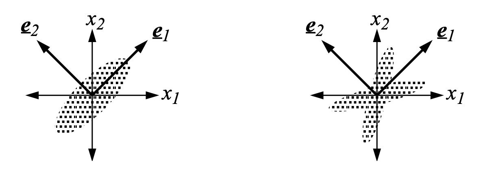

**PCA** is a popular [[dimensionality reduction]] technique. 

Given a zero-centered design matrix $X$ with d dimensions, we want to project $X$ onto a $k$-dimensional subspace, where $k < d$, which maximizes the amount of sample variance captured.

> [!idea] Projection onto a subspace
> Given a subspace composed of orthonormal vectors $v_1, v_2, \dots, v_k$, the projection of vector $x$ onto the subspace is $\tilde{x} = \sum_{i=1}^k (x \cdot v_i) v_i$.

As it turns out, these subspaces are defined by the [[eigenvalues|eigenvectors]], or a subset of eigenvectors, of $X^{\top}X$. This is because $X^{\top}X$ will be a square, symmetric, PSD matrix, giving it mutually orthonormal eigenvectors.

There are numerous derivations for PCA. They employ concepts like [[rayleigh quotient]], [[multivariate gaussians]], and [[singular value decomposition]].

### limitations
Because PCA looks only at the covariance between pairs of variables (linear pairwise correlations), that means it can only take into account second-order relationships. However, it's entirely possible that your data contains higher-order relationships, which will not be removed by PCA.

The following two geometric visualizations of PCA are broken down into the same principal components, despite having visually different structures. This is because of the presence of higher-order relationships within the example on the right. 

For this reason, PCA does operate with the underlying assumption that the data have a **Gaussian** structure.

