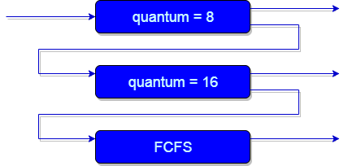

#cs162 

In the [[operating system]], **scheduling** is the process of deciding which [[threads]] are given access to various machine resources at any given time.
### goals
An optimal scheduler takes into account the following goals
- **Minimize completion time**: waiting time + run time of [[processes]]
- **Maximize throughput**: the rate at which tasks are completed, deals with efficient use of resources (minimize overhead)
- **Maintain fairness**: sharing resources between threads in some equitable manner
The fairness criterion is the most subjective and vague of them all. It often times contradicts the goal of minimizing completion time.

## scheduler policies

>[!definition] Pre-emption
>In the context of the OS, preemption is the ability of the OS to pause or stop a currently scheduled task. This is how we implement **context switching** to schedule higher-priority tasks. 
#### first come first serve
First come first serve (FCFS) scheduling simply schedules tasks in the order they arrive in the queue.
- Cheap to implement, and good for maximizing throughput because it minimizes the overhead of context switching
- **Convoy effect**: short tasks will get stuck with long wait times behind long tasks, which makes the average completion time vary a lot.

#### shortest job first
Two similar scheduling policies are *shortest job first (SJF)* and *shortest remaining time first (SRTF)*. 
- **SJF**: schedule the shortest task first
- **SRTF**: preempt the resource if a task arrives in the queue with a shorter completion time than the currently-running task
These policies are provably optimal for minimizing the average completion time for both pre-emptive and non-preemptive policies, respectively. Unfortunately, these policies also involve the impossible idea of knowing how long a task will take ahead of time.

#### round robin
Round Robin (RR) schedules tasks such that each thread takes turns using the resource for a small amount of time, known as our **time quantum** $q$.
- Once $q$ elapses, the ongoing task is pre-empted and added to the end of the ready queue.
- When $q$ is sufficiently large, RR resembles FCFS, because most or all tasks are able to run to completion within a single quanta. However, a small $q$ requires a lot of overhead with frequent context switching.
Round Robin ensures fairness because of the uniform $q$. For example, if there are $n$ tasks in the queue, each task gets exactly $\frac{1}{n}$ of the resource, and will not wait more than $(n-1) \cdot q$ time units to be scheduled.

#### multi-level feedback queue
Multi-level Feedback Queue (MLFQ) uses multiple queues which each follow different scheduling policies. Tasks begin at the highest priority queue and move down to lower priority queues as they hog up more and more of a resource.
- Ensures that long running tasks (e.g. CPU bound) can't hog resources by keeping short running tasks (e.g. I/O bound) at higher priority

